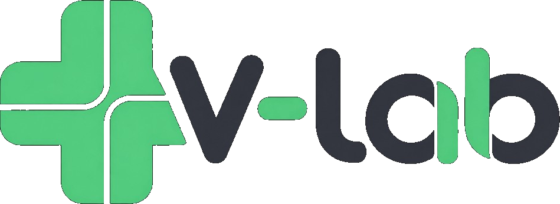
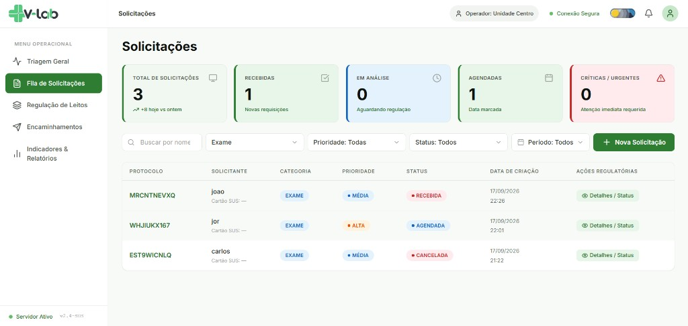
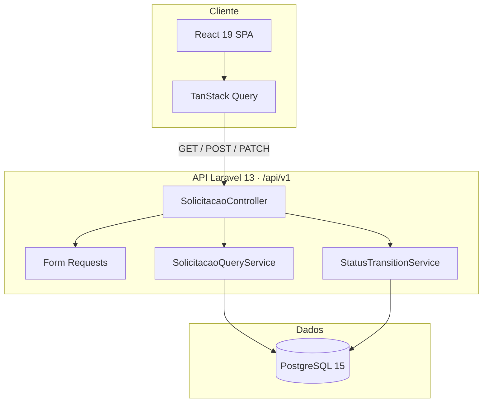
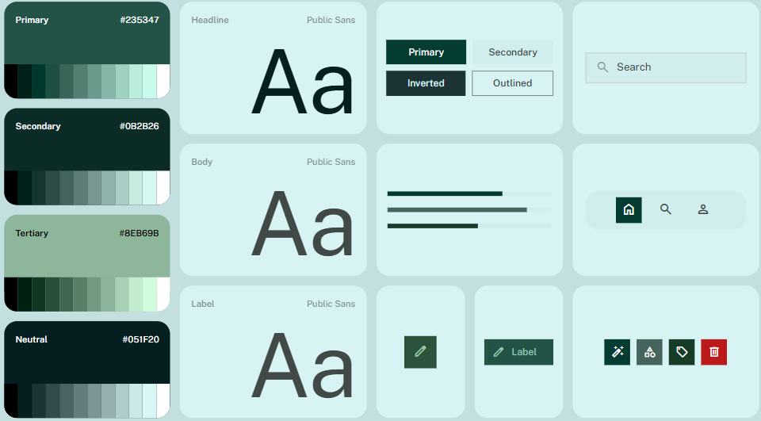
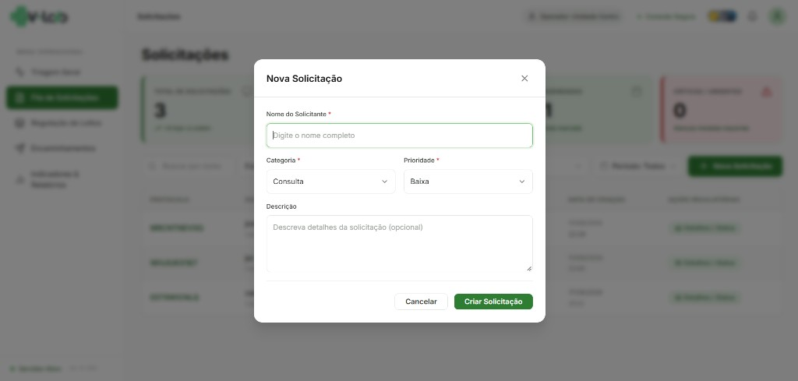
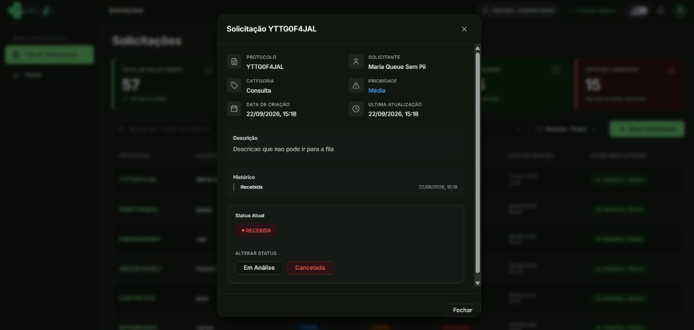

# V-Lab

<p align="center">
  
</p>

**Sistema de gestão de solicitações de atendimento para unidades públicas de saúde.**

React · TypeScript · Laravel · PostgreSQL · Docker

Repositório: [soninhoxs/Projeto-Vlab](https://github.com/soninhoxs/Projeto-Vlab)



_Fila operacional — KPIs, filtros e listagem paginada._

---

## Sobre o projeto

O **V-Lab** registra e acompanha solicitações encaminhadas a uma unidade: protocolo único, categoria, prioridade, status e trilha de datas. O recorte é o de uma **fila de regulação** — o operador vê o que chegou, filtra, abre o detalhe e avança o status segundo regras de negócio, não atalhos na interface.

Foi desenhado para o processo seletivo **V-Lab Cln UFPE**: stack simples, contrato REST explícito e decisões que aguentam volume sem copiar arquitetura de ERP (mensageria, microserviços).

### Problema

Filas de atendimento misturam busca, período, prioridade e ciclo de vida do pedido. Se o status for um campo livre, a operação quebra. Se cada filtro for um `WHERE` solto no controller, a API vira um amontoado frágil. Se a lista só atualiza depois de um refetch lento, o operador acha que o cadastro falhou.

### Solução

- **Domínio no servidor** — enums, state machine e Form Requests; o cliente não inventa transição.
- **Consulta em um serviço** — filtros (status, categoria, prioridade, busca, período) isolados do controller.
- **SPA com cache honesto** — React Query; o `201` confirmado entra na lista, sem linha fake.
- **Um Compose** — Postgres + API + Vite; OPcache e workers no PHP para TTFB previsível.

---

## Arquitetura



Fluxo: o browser fala só com `/api/v1`. Listagem e filtros passam pelo `SolicitacaoQueryService`. Criação valida no `StoreSolicitacaoRequest` e gera protocolo no model. Mudança de status passa pelo `StatusTransitionService` — estados finais (`CONCLUIDA`, `CANCELADA`) não voltam.

Não há fila, Redis nem barramento. Para este recorte, I/O síncrono + índices no Postgres é o caminho certo.

### Contrato da API

| Método | Endpoint | Papel |
|--------|----------|--------|
| `GET` | `/api/v1/solicitacoes` | Lista paginada + filtros |
| `POST` | `/api/v1/solicitacoes` | Cria (protocolo no servidor) |
| `GET` | `/api/v1/solicitacoes/{id}` | Detalhe |
| `PATCH` | `/api/v1/solicitacoes/{id}/status` | Transição validada |

Filtros de listagem: `status`, `categoria`, `prioridade`, `busca`, `data_inicio`, `data_fim` (`Y-m-d`). Período aplica intervalo em `created_at` (`>= 00:00:00` / `<= 23:59:59`), não `whereDate` por linha.

OpenAPI: [`backend/docs/openapi.yaml`](backend/docs/openapi.yaml)

---

## Decisões de engenharia

**State machine fora do controller.** Transições ficam em `StatusTransitionService`:

- `RECEBIDA` → `EM_ANALISE` \| `CANCELADA`
- `EM_ANALISE` → `AGENDADA` \| `CANCELADA`
- `AGENDADA` → `CONCLUIDA` \| `CANCELADA`
- `CONCLUIDA` / `CANCELADA` → finais

O PATCH só aplica o que o serviço autoriza. Isso evita status “inventado” no JSON e concentra a regra num ponto testável.

**Enums PHP + Form Requests.** `Categoria`, `Prioridade` e `Status` são enums. Validação de create, listagem e patch não mora no controller. URGENTE exige justificativa. Mass assignment não inclui `status` nem `protocolo`.

**Query object para a fila.** `SolicitacaoQueryService` monta o SELECT: LIKE com escape de `%`/`_`, enums, período. O controller não acumula `if`.

**Cache da lista = dado do servidor.** Depois do POST `201`, o frontend grava o payload confirmado no React Query (página 1) e invalida a query. Não há insert otimista com id local — o protocolo que aparece é o mesmo do banco.

**Calendário próprio.** `<input type="date">` nativo estourava o layout, pintava seleção azul e mandava `99/99/9999` para a API (422 disfarçado de “erro de conexão”). O período é `dd/mm/aaaa` por segmento + painel, com validação **antes** do request.

**Docker magro.** A imagem PHP já traz `pdo_pgsql` e OPcache. O entrypoint **só migra** (seed é opt-in). Compose: 4 workers no `artisan serve`, cache em arquivo, sessão em array, fila sync. Lista aquecida na casa de ~135–185 ms de TTFB — suficiente sem Kafka.

**Superfície pequena.** Postgres e API escutam `127.0.0.1`. CORS só no Vite. Rate limit 60 req/min. Headers `nosniff` / `DENY`. Erros de API sem stack. Cartão SUS mascarado no cliente; o app **não inventa** identificador de saúde.

O desafio **não pede login**. Autorização HTTP fica aberta no recorte local; a defesa é validação, máquina de estados e API mínima — não um IAM de faz-de-conta.

---

## Destaques técnicos

| Área | Implementação |
|------|----------------|
| **Frontend** | React 19, TypeScript, Vite, TanStack Query, Axios, Lucide, tokens CSS (claro/escuro) |
| **Backend** | PHP 8.4, Laravel 13, enums, Form Requests, resources JSON |
| **Dados** | PostgreSQL 15, migrations, factory/seeder, índices na fila |
| **Fila** | Paginação, busca, categoria, prioridade, status, período |
| **Qualidade** | PHPUnit (API + transições), Vitest (datas, máscara, cache) |
| **DevOps** | Docker Compose, healthcheck do Postgres, OPcache |

---

## Design e UX

Fila de regulação: hierarquia clara (KPIs → filtros → tabela), marca própria e design system (paleta, Public Sans, componentes).

### Identidade visual

A marca do app é a **logo criada para o V-Lab** — cruz + wordmark. Não foi redesenhada por IA. Está na sidebar, no header e na aba do navegador.

<p>
  
</p>

<p>
  
</p>

| Peça | Arquivo | Uso |
|------|---------|-----|
| Wordmark | [`docs/logo-vlab.png`](docs/logo-vlab.png) · [`frontend/public/logo-vlab.png`](frontend/public/logo-vlab.png) | Sidebar e header |
| Cruz (favicon) | [`docs/favicon.png`](docs/favicon.png) · [`frontend/public/favicon.png`](frontend/public/favicon.png) | Ícone da aba (16×16); a logo inteira ilegível nesse tamanho |
| Vetor | [`docs/logo-vlab.svg`](docs/logo-vlab.svg) | Fonte vetorial da marca |

### Design system

Board de cor, tipo e componentes da identidade:



| Token | Hex | Papel |
|-------|-----|--------|
| **Primary** | `#235347` | Ação principal, ênfase |
| **Secondary** | `#0B2B26` | Superfície invertida, contraste alto |
| **Tertiary** | `#8EB69B` | Apoio, chips, estados suaves |
| **Neutral** | `#051F20` | Texto e fundo profundo |

**Tipo:** Public Sans — headline, body e label na mesma família (hierarquia por peso/tamanho, não por fonte extra).

**Componentes do board:** botões Primary / Secondary / Inverted / Outlined, campo de busca, navegação icônica, chips e ações (anexo, label, excluir).

| Princípio | Na prática |
|-----------|------------|
| **Leitura rápida** | Protocolo em destaque, badges de categoria/prioridade/status |
| **Filtro na mesma linha** | Busca, categoria, prioridade, status, período e CTA sem scroll horizontal |
| **Confiança** | Modal de detalhe com transições possíveis; inválidas nem aparecem |
| **Acessibilidade** | `aria-*` nos filtros e modais, skip link, teclado nos dropdowns |

Fluxos: **capturar** (nova solicitação) → **varrer a fila** (filtros + período) → **agir** (detalhe / próximo status).

Sidebar vira drawer no estreito; o hamburger abre e fecha. Header (operador, conexão, tema, ações) alinha na mesma linha.

---

## Galeria



_**Criar** — validação no cliente e no Form Request; urgente pede justificativa._



_**Detalhe** — tema escuro; só os status legais da máquina de estados._

---

## Funcionalidades

### Operação

- KPIs da fila (total, recebidas, em análise, agendadas, críticas)
- Listagem paginada com protocolo, solicitante, categoria, prioridade, status, data
- Filtros + período de criação (`created_at`)
- Criação com protocolo gerado no `creating` do model (`Str::random`)
- Detalhe e avanço de status

### Interface

- Tema claro/escuro persistente (trocar tema **não** fecha filtro/calendário)
- Logo V-Lab oficial; favicon só com a cruz
- Estados de loading, vazio e erro de API

### Fora deste recorte

Autenticação, edição após criar (exceto status), exclusão, histórico de transições e logs estruturados. O `/up` do Laravel cobre o healthcheck do Compose.

---

## Stack

**Frontend** — React 19 · TypeScript · Vite · TanStack Query · Axios · Lucide

**Backend** — PHP 8.4 · Laravel 13 · PostgreSQL 15

**Infra** — Docker Compose · OPcache · 4 workers PHP CLI

---

## Como executar

Pré-requisitos: Docker Desktop e Git.

```bash
git clone https://github.com/soninhoxs/Projeto-Vlab.git
cd Projeto-Vlab
docker compose up -d
```

| Serviço | URL |
|---------|-----|
| Frontend | http://localhost:5173 |
| API | http://localhost:8000/api/v1 |

O backend espera o Postgres healthy e roda **migrations**. Seed (opcional):

```bash
docker exec vlab_backend php artisan db:seed --force
```

Variáveis no `docker-compose.yml`. Modelo sem senha real: [`backend/.env.example`](backend/.env.example). Não commitar `.env`.

---

## Estrutura do repositório

```
├── frontend/                 # SPA Vite
│   └── src/
│       ├── api/              # Axios + escrita no cache da lista
│       ├── components/       # Fila, filtros, modais, layout
│       ├── hooks/            # Query/mutations
│       └── utils/            # Datas BR, máscara SUS
├── backend/
│   ├── app/
│   │   ├── Enums/
│   │   ├── Http/             # Controller, Requests, Resources
│   │   ├── Models/
│   │   └── Services/         # Query + state machine
│   ├── database/             # migrations, factory, seeder
│   ├── docs/openapi.yaml
│   └── tests/
├── docs/
│   ├── logo-vlab.png
│   ├── favicon.png
│   ├── design-system.png     # Paleta, tipo e componentes
│   └── screenshots/
└── docker-compose.yml
```

---

## Testes

```bash
docker exec vlab_backend php artisan test
cd frontend && npm run test:run
```

Backend: transições válidas/inválidas e listagem com `data_inicio` / `data_fim`.  
Frontend: parsing de data BR, máscara do Cartão SUS, insert da linha criada no cache.

---

## Contato

Projeto para o processo seletivo **V-Lab Cln UFPE** — full-stack, domínio de fila e API previsível.

GitHub: [@soninhoxs](https://github.com/soninhoxs)
