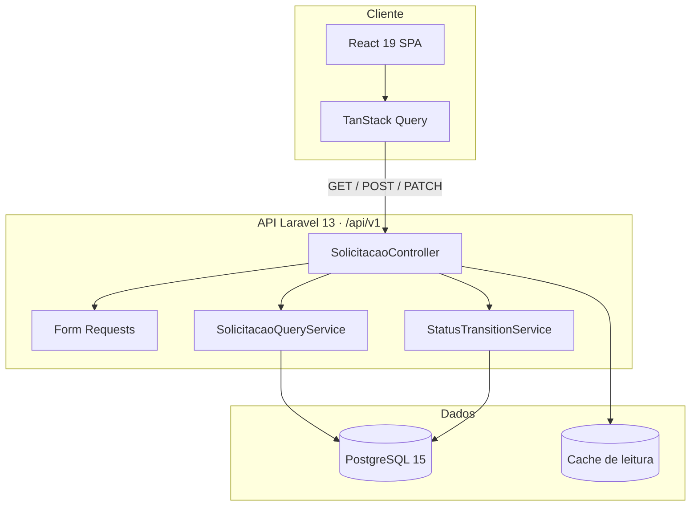
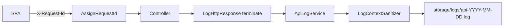

# V-Lab

<p align="center">
  
</p>

**Sistema de gestão de solicitações de atendimento para unidades públicas de saúde.**

React · TypeScript · Laravel · PostgreSQL · Docker

Repositório: [soninhoxs/Projeto-Vlab](https://github.com/soninhoxs/Projeto-Vlab)


_Fila operacional — KPIs, filtros e listagem paginada._

---

## Sobre o projeto

O **V-Lab** registra e acompanha solicitações encaminhadas a uma unidade: protocolo único, categoria, prioridade, status e trilha de datas. O recorte é o de uma **fila de regulação** — o operador vê o que chegou, filtra, abre o detalhe e avança o status segundo regras de negócio, não atalhos na interface.

Foi desenhado para o processo seletivo **V-Lab Cln UFPE**: stack simples, contrato REST explícito e decisões que aguentam volume sem copiar arquitetura de ERP (mensageria, microserviços).

### Problema

Filas de atendimento misturam busca, período, prioridade e ciclo de vida do pedido. Se o status for um campo livre, a operação quebra. Se cada filtro for um `WHERE` solto no controller, a API vira um amontoado frágil. Se a lista só atualiza depois de um refetch lento, o operador acha que o cadastro falhou.

### Solução

- **Domínio no servidor** — enums, state machine e Form Requests; o cliente não inventa transição.
- **Consulta em um serviço** — filtros (status, categoria, prioridade, busca, período) isolados do controller.
- **SPA com cache honesto** — TanStack Query; o `201` confirmado entra na página 1, sem linha fake e **sem refetch de todas as páginas**. A lista só busca de novo quando o operador muda página ou filtro (fresco por 5 min).
- **Um Compose** — Postgres + API + Vite; `vendor` em volume Linux, OPcache e 8 workers no PHP para o bind mount do Windows não travar cada GET.

---

## Arquitetura



Fluxo: o browser fala só com `/api/v1`. Listagem e filtros passam pelo `SolicitacaoQueryService`. Criação valida no `StoreSolicitacaoRequest` e gera protocolo no model. Mudança de status passa pelo `StatusTransitionService` — estados finais (`CONCLUIDA`, `CANCELADA`) não voltam. Create e PATCH gravam `solicitacao_status_historico` na mesma transação.

Não há fila, Redis nem barramento. Para este recorte, I/O síncrono + índices no Postgres + cache de leitura é o caminho certo.

### Contrato da API

| Método | Endpoint | Papel | Por que este verbo |
|--------|----------|--------|--------------------|
| `GET` | `/api/v1/solicitacoes` | Lista paginada + filtros + KPIs | Leitura; pode ir em cache |
| `POST` | `/api/v1/solicitacoes` | Cria (protocolo no servidor) | Recurso novo; status começa em `RECEBIDA` |
| `GET` | `/api/v1/solicitacoes/{id}` | Detalhe + histórico de status | Leitura pontual |
| `PATCH` | `/api/v1/solicitacoes/{id}/status` | Só o próximo status | Atualização parcial; a máquina de estados decide |

**Não há** `PUT` (substituiria o registro inteiro), `DELETE` (fora do recorte) nem tela de login. CORS libera só `GET`, `POST`, `PATCH` e `OPTIONS`.

Filtros de listagem: `status`, `categoria`, `prioridade`, `busca`, `data_inicio`, `data_fim` (`Y-m-d`). Período aplica intervalo em `created_at` (`>= 00:00:00` / `<= 23:59:59`), não `whereDate` por linha.

OpenAPI: [`backend/docs/openapi.yaml`](backend/docs/openapi.yaml) — alinhado ao Form Request (sem Cartão SUS, sem datas inventadas no create; `historico_status` no detalhe).

---

## Decisões de engenharia

**State machine fora do controller.** Transições ficam em `StatusTransitionService`:

- `RECEBIDA` → `EM_ANALISE` \| `CANCELADA`
- `EM_ANALISE` → `AGENDADA` \| `CANCELADA`
- `AGENDADA` → `CONCLUIDA` \| `CANCELADA`
- `CONCLUIDA` / `CANCELADA` → finais

O PATCH só aplica o que o serviço autoriza. Isso evita status “inventado” no JSON e concentra a regra num ponto testável.

**Enums PHP + Form Requests.** `Categoria`, `Prioridade` e `Status` são enums. Validação de create, listagem e patch não mora no controller. URGENTE exige justificativa. Mass assignment não inclui `status` nem `protocolo`.

**Query object para a fila.** `SolicitacaoQueryService` monta o SELECT: LIKE com escape de `%`/`_`, enums, período. O controller não acumula `if`.

**Histórico de status na mesma transação.** Cada `create` e cada `transition` grava `solicitacao_status_historico`. O `GET` de detalhe devolve a trilha; o modal não inventa datas. Colisão de protocolo no `creating` tenta de novo em vez de 500.

**Cache em duas camadas.** A listagem não consulta o Postgres a cada clique e **não despeja milhares de linhas** — 7 por página.

| Camada | Onde | TTL | Invalidação |
|--------|------|-----|-------------|
| **Cliente** | TanStack Query | fresco 5 min; sem polling, sem refetch em foco/reconnect | PATCH de status (só queries ativas); POST só escreve a página 1 |
| **Persistência** | `sessionStorage` | metadados da dashboard | listas `solicitacoes` / `solicitacao` **não** são gravadas (PII) |
| **API** | `Cache::remember` da página + KPIs | 30 s (lista), 15 s (summary) | `SolicitacaoObserver` sobe a versão da chave |

Filtro mais estreito pode ser derivado do cache completo, sem novo GET. Se a API falhar e ainda houver dado, a tabela **não some**.

**Fila que não tapa o cadastro.** GET de lista usa só o `AbortSignal` do React Query — **não cancela o GET da página atual** ao pedir a seguinte. Abrir “Nova solicitação” e o POST abortam listas em voo para o worker ficar livre. Axios **não** manda `Content-Type: application/json` em GET (isso disparava `OPTIONS` por página e dobrava o boot do PHP).

**Datas ISO na API.** `SolicitacaoResource` serializa `created_at` em UTC (`Y-m-d\TH:i:s\Z`). Cache em arquivo não pode devolver `Carbon` incompleto — a lista quebrava em “—” na data a partir da página 4.

**Calendário próprio.** `<input type="date">` nativo estourava o layout, pintava seleção azul e mandava `99/99/9999` para a API (422 disfarçado de “erro de conexão”). O período é `dd/mm/aaaa` por segmento + painel, com validação **antes** do request.

**Docker no Windows sem I/O no `vendor`.** Bind mount de milhares de arquivos PHP no Docker Desktop é o que fazia o `/up` levar ~4 s e cada página da fila 3–8 s. O Compose monta `vlab_vendor` em Linux; o entrypoint roda `composer install` e depois `artisan serve`. Cache/sessão em `array`, 8 workers, log em `stderr`, `LOG_HTTP_ENABLED=false` no Compose (o canal `api` em arquivo continua disponível fora do Docker).

**Superfície pequena e validação no servidor.** O desafio **não pede login**. A defesa do recorte local é API mínima + integridade, não IAM:

| Controle | Como |
|----------|------|
| Bind | Postgres e API em `127.0.0.1` |
| CORS | só `http://localhost:5173`; métodos `GET/POST/PATCH/OPTIONS` |
| Rate limit | GET 120/min; POST/PATCH 30/min por IP |
| Headers | `nosniff`, `DENY`, `Referrer-Policy`, `Permissions-Policy` |
| Erros | JSON sem stack (`APP_DEBUG=false` no Compose) |
| Create | nome 3–120, só letras; HTML stripped; URGENTE exige justificativa |
| Lista | enums nos filtros; busca máx. 100; LIKE com escape de `%`/`_` |
| Status | PATCH só `{ status }`; transições ilegais → 422 |
| Mass assignment | `status` e `protocolo` **não** são fillable |
| PII | a API **não** pede Cartão SUS/CNS; nomes da fila **não** vão para `sessionStorage` |

`API_AUTH_ENABLED` existe no backend (Sanctum) mas **vem desligado**. A fila abre direto em http://localhost:5173.

---

## Logs e observabilidade

A API não grava o corpo da solicitação (nome, descrição, justificativa). Log é para **operar e correlacionar**, não para espelhar o prontuário.



Cada request em `api/*` recebe um `X-Request-Id` (UUID, ou o valor do cliente se for opaco `A-Za-z0-9_-` de 8–64 caracteres). O mesmo id volta no header da resposta (CORS expõe o header) e entra em todo evento do canal `api`. Healthcheck `/up` não é logado. `GET /solicitacoes` 2xx mais rápido que 400 ms também **não** gera `http.response` — senão o disco vira gargalo na fila.

| Evento | Quando | Campos |
|--------|--------|--------|
| `http.response` | fim de cada request `api/*` | método, path, rota, status, frase MDN, categoria, `duration_ms`, `request_id` |
| `solicitacao.created` | POST que criou o registro | `solicitacao_id`, protocolo, categoria, prioridade, status |
| `solicitacao.status_updated` | PATCH de transição | id, protocolo, `from_status`, `to_status` |

Nível segue o status HTTP — 2xx `info`, 4xx `warning`, 5xx `error`. Validação `422` não vira incidente; `500` sim.

**Sanitização (LGPD).** `LogContextSanitizer` troca por `[redacted]` chaves com `password`, `senha`, `token`, `authorization`, `cookie`, `cpf`, `email`, `nome_solicitante`, `descricao`, `justificativa`. Strings longas cortam em 512 caracteres. O interceptor Axios, em DEV, loga erro no console **sem query string** (a busca pode ter nome).

Arquivo (fora do Compose): `backend/storage/logs/api-YYYY-MM-DD.log`, JSON por linha, retenção 14 dias (`LOG_API_DAYS`). No Docker o canal padrão é `stderr` e `LOG_HTTP_ENABLED=false`. Liga/desliga: `LOG_HTTP_ENABLED`.

```bash
docker logs vlab_backend --tail 50
```

Para gravar o canal `api` em arquivo, suba com `LOG_HTTP_ENABLED=true` e `LOG_CHANNEL=stack`.

---

## Destaques técnicos

| Área | Implementação |
|------|----------------|
| **Frontend** | React 19, TypeScript, Vite, TanStack Query, Axios, Lucide, tokens CSS (claro/escuro) |
| **Backend** | PHP 8.4, Laravel 13, enums, Form Requests, resources JSON |
| **Dados** | PostgreSQL 15, migrations, factory/seeder, índices na fila |
| **Fila** | Paginação, busca, categoria, prioridade, status, período |
| **Logs** | Canal `api` JSON diário, `X-Request-Id`, eventos de domínio, PII redigida |
| **Qualidade** | PHPUnit em SQLite isolado, Vitest, Playwright (criar → listar → transicionar), CI GitHub Actions |
| **DevOps** | Docker Compose, volume `vendor`, healthcheck, OPcache, 8 workers |

---

## Design e UX

Fila de regulação: hierarquia clara (KPIs → filtros → tabela), marca própria e design system (paleta, Public Sans, componentes).

### Identidade visual

A marca do app é a **logo criada para o V-Lab** — cruz + wordmark. Não foi redesenhada por IA. Está na sidebar, no header e na aba do navegador.

<p>
  
</p>

<p>
  
</p>

| Peça | Arquivo | Uso |
|------|---------|-----|
| Wordmark | [`docs/logo-vlab.png`](docs/logo-vlab.png) · [`frontend/public/logo-vlab.png`](frontend/public/logo-vlab.png) | Sidebar e header |
| Cruz (favicon) | [`docs/favicon.png`](docs/favicon.png) · [`frontend/public/favicon.png`](frontend/public/favicon.png) | Ícone da aba (16×16); a logo inteira ilegível nesse tamanho |
| Vetor | [`docs/logo-vlab.svg`](docs/logo-vlab.svg) | Fonte vetorial da marca |

### Design system

Board de cor, tipo e componentes da identidade:


| Token | Hex | Papel |
|-------|-----|--------|
| **Primary** | `#235347` | Ação principal, ênfase |
| **Secondary** | `#0B2B26` | Superfície invertida, contraste alto |
| **Tertiary** | `#8EB69B` | Apoio, chips, estados suaves |
| **Neutral** | `#051F20` | Texto e fundo profundo |

**Tipo:** Public Sans — headline, body e label na mesma família (hierarquia por peso/tamanho, não por fonte extra).

**Componentes do board:** botões Primary / Secondary / Inverted / Outlined, campo de busca, navegação icônica, chips e ações (anexo, label, excluir).

| Princípio | Na prática |
|-----------|------------|
| **Leitura rápida** | Protocolo em destaque, badges de categoria/prioridade/status |
| **Filtro na mesma linha** | Busca, categoria, prioridade, status, período e CTA sem scroll horizontal |
| **Confiança** | Modal de detalhe com transições possíveis; inválidas nem aparecem |
| **Acessibilidade** | `aria-*` nos filtros e modais, skip link, teclado nos dropdowns |

Fluxos: **capturar** (nova solicitação) → **varrer a fila** (filtros + período) → **agir** (detalhe / próximo status).

Sidebar vira drawer no estreito; o hamburger abre e fecha. Header (operador, conexão, tema, ações) alinha na mesma linha.

---

## Galeria


_**Criar** — validação no cliente e no Form Request; urgente pede justificativa._


_**Detalhe** — tema escuro; só os status legais da máquina de estados._

---

## Funcionalidades

### Operação

- KPIs da fila (total, recebidas, em análise, agendadas, críticas)
- Listagem paginada com protocolo, solicitante, categoria, prioridade, status, data
- Filtros + período de criação (`created_at`)
- Criação com protocolo gerado no `creating` do model (`Str::random`, com retry se colidir)
- Detalhe, avanço de status e **histórico de transições** no modal

### Interface

- Tema claro/escuro persistente (trocar tema **não** fecha filtro/calendário)
- Logo V-Lab oficial; favicon só com a cruz
- Estados de loading, vazio e erro de API (erro bloqueante só se não houver cache; console DEV correlaciona com `X-Request-Id`)

### Fora deste recorte

Autenticação de operador, edição após criar (exceto status) e exclusão. O `/up` do Laravel cobre o healthcheck do Compose.

---

## Stack

**Frontend** — React 19 · TypeScript · Vite · TanStack Query · Axios · Lucide

**Backend** — PHP 8.4 · Laravel 13 · PostgreSQL 15

**Infra** — Docker Compose · OPcache · 8 workers PHP CLI · volume Linux para `vendor`

---

## Como executar

Pré-requisitos: Docker Desktop e Git.

```bash
git clone https://github.com/soninhoxs/Projeto-Vlab.git
cd Projeto-Vlab
docker compose up -d
```

| Serviço | URL |
|---------|-----|
| Frontend | http://localhost:5173 |
| API | http://localhost:8000/api/v1 |

O backend espera o Postgres healthy, instala o `vendor` no volume Linux (primeira subida demora o `composer install`) e roda **migrations**. Não há tela de login. Seed (dados de exemplo, opcional):

```bash
docker exec vlab_backend php artisan db:seed --force
```

Variáveis no `docker-compose.yml`: `VLAB_LIST_CACHE_SECONDS=30`, `VLAB_SUMMARY_CACHE_SECONDS=15`, `PHP_CLI_SERVER_WORKERS=8`, `CACHE_STORE=array`. Modelo: [`backend/.env.example`](backend/.env.example) e [`frontend/.env.example`](frontend/.env.example). Não commitar `.env`.

PHPUnit **não** usa o Postgres do Compose: `tests/TestCase.php` força SQLite `:memory:`, para `artisan test` não apagar a fila local.

---

## Estrutura do repositório

```
├── .github/workflows/ci.yml  # PHPUnit + Vitest + build Vite + Playwright
├── frontend/                 # SPA Vite
│   ├── e2e/                  # smoke: criar → listar → transicionar
│   └── src/
│       ├── api/              # Axios, React Query, cache da lista
│       ├── components/       # Fila, filtros, modais, layout
│       ├── hooks/            # Query e mutations (sem polling)
│       └── utils/            # Datas BR, HTTP status
├── backend/
│   ├── app/
│   │   ├── Enums/
│   │   ├── Http/             # Controller, Requests, Resources, middleware de log
│   │   ├── Logging/          # Formatter JSON do canal api
│   │   ├── Models/           # Solicitacao + SolicitacaoStatusHistorico
│   │   ├── Observers + Policies
│   │   ├── Services/         # Query, state machine, ApiLogService
│   │   └── Support/          # Cache da fila, HTTP status, sanitizer de logs
│   ├── database/             # migrations (histórico + índices), factory, seeder
│   ├── docs/openapi.yaml
│   └── tests/                # SQLite :memory: (não toca o Postgres do Docker)
├── docs/
│   ├── logo-vlab.png
│   ├── favicon.png
│   ├── design-system.png
│   └── screenshots/
└── docker-compose.yml
```

---

## Testes

```bash
docker exec vlab_backend php artisan test
cd frontend && npm run test:run
cd frontend && npx playwright test
```

Backend: transições válidas/inválidas, histórico de status, colisão de protocolo, listagem com período, cache da fila sem query repetida, `X-Request-Id`, `http.response` e redaction de PII.  
Frontend: data BR, validação do formulário, tabela/paginação, insert no cache, persistência **sem** PII da lista, GET sem `Content-Type`, mensagem por status HTTP.  
E2E (Playwright): criar → listar → `RECEBIDA → EM_ANALISE` → conferir o histórico. CI em [`.github/workflows/ci.yml`](.github/workflows/ci.yml) (PHPUnit SQLite + Vitest + `vite build` + smoke Playwright).

---

## Contato

Projeto para o processo seletivo **V-Lab Cln UFPE** — full-stack, domínio de fila e API previsível.

GitHub: [@soninhoxs](https://github.com/soninhoxs)
